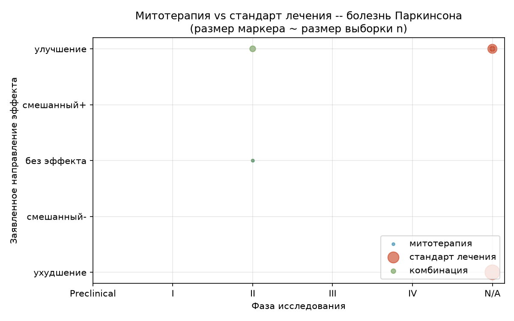
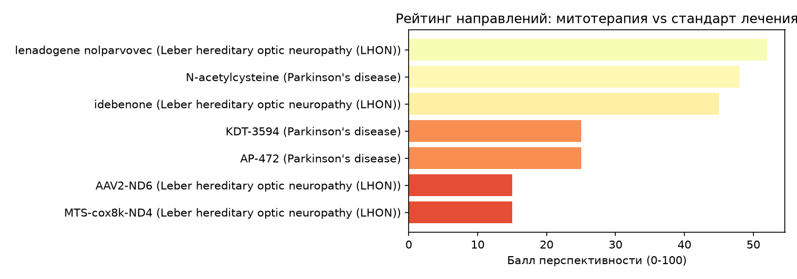

# Harness для анализа исследований в митохондриальной медицине -- мини-обзор

**Запрос:** Сравни MitoQ со стандартной терапией при болезни Паркинсона
**Заболевания:** болезнь Паркинсона, наследственная оптическая нейропатия Лебера (LHON)
**Временное окно:** с 2021 по настоящее время
**Сгенерировано:** 2026-09-28T12:54:49.848365 UTC

> Это автоматизированный инструмент исследовательского скрининга, а не систематический обзор и не клиническая рекомендация для конкретного пациента. См. раздел «Ограничения» ниже.

## Простыми словами

Этот текст — краткий обзор научных работ, а не медицинский совет или руководство к действию. При болезни Паркинсона стандартное лечение опирается на крупные исследования и дает предсказуемые результаты. Использование добавок для митохондрий пока изучено очень слабо: данных недостаточно, чтобы оценить их реальную пользу. Наиболее перспективным направлением при этой болезни сейчас считают комбинированную терапию, но в таких исследованиях участвовало слишком мало людей, чтобы делать окончательные выводы. Наименее многообещающими выглядят новые методы, которые находятся на стадии лабораторных испытаний (проверок на животных или в пробирках), так как они еще не доказали свою эффективность на людях. Важно понимать, что наука пока не дает четких ответов о преимуществах митохондриальных добавок перед обычными лекарствами. Данный обзор основан на ограниченных данных и не может заменить консультацию специалиста. Пожалуйста, обязательно обсудите любые решения о вашем лечении с лечащим врачом.

*Дальше -- та же информация подробно, с научными терминами, ссылками на источники и цифрами, для тех, кому это важно проверить.*

## Обоснование плана

- **search** (literature_searcher): Необходимо собрать актуальные данные клинических и доклинических исследований MitoQ в контексте нейродегенерации.
- **extract** (data_extractor): Важно выделить ключевые показатели эффективности MitoQ, такие как снижение окислительного стресса и влияние на двигательные функции.
- **review** (reviewer_validator): Требуется критическая оценка методологии исследований для определения достоверности терапевтического потенциала MitoQ.
- **compare** (comparator_analyst): Необходимо сопоставить фармакодинамику MitoQ с текущим стандартом лечения (леводопа и др.) для выявления преимуществ и ограничений.
- **score** (perspective_scorer): Нужна количественная оценка доказательной базы для определения перспективности MitoQ как адъювантной терапии.
- **report** (orchestrator): Итоговый отчет систематизирует данные для формирования экспертного заключения о месте MitoQ в терапии болезни Паркинсона.

## Сравнение: митотерапия vs стандарт лечения

### болезнь Паркинсона

Текущие данные по болезни Паркинсона указывают на то, что комбинированная терапия демонстрирует наиболее высокие показатели эффективности, однако доказательная база остается ограниченной из-за малого размера выборок. Стандартная терапия опирается на более крупные исследования, но показывает умеренные результаты, в то время как митохондриальная терапия представлена лишь одним исследованием без достаточных данных для оценки клинического эффекта.

- Исследований митотерапии: 1 | Исследований стандарта лечения: 3

*Как читать этот график: по горизонтали -- фаза исследования (Preclinical = не на людях, а в лаборатории/на животных; I-IV -- фазы клинических испытаний на людях; N/A -- обычно наблюдательные/когортные данные по уже применяемому лечению, без формальной фазы). По вертикали -- какое направление эффекта заявлено в первоисточнике: это категория (ухудшение / без эффекта / улучшение и т.д.), а не сила эффекта -- шкала не показывает, *насколько* сильно исследование улучшило или ухудшило состояние. Размер точки ~ размер выборки (n): чем крупнее точка, тем больше участников. Цвет -- рука исследования: синий = митотерапия, оранжевый = стандарт лечения, зелёный = комбинация.*

### наследственная оптическая нейропатия Лебера (LHON)

Анализ показывает, что митохондриальная терапия демонстрирует более выраженный положительный эффект по сравнению со стандартным лечением при болезни Лебера. Однако доказательная база для митотерапии остается ограниченной и состоит преимущественно из доклинических исследований и небольших серий случаев, что требует осторожности в интерпретации результатов.

- Исследований митотерапии: 4 | Исследований стандарта лечения: 3

.png)

*Как читать этот график: по горизонтали -- фаза исследования (Preclinical = не на людях, а в лаборатории/на животных; I-IV -- фазы клинических испытаний на людях; N/A -- обычно наблюдательные/когортные данные по уже применяемому лечению, без формальной фазы). По вертикали -- какое направление эффекта заявлено в первоисточнике: это категория (ухудшение / без эффекта / улучшение и т.д.), а не сила эффекта -- шкала не показывает, *насколько* сильно исследование улучшило или ухудшило состояние. Размер точки ~ размер выборки (n): чем крупнее точка, тем больше участников. Цвет -- рука исследования: синий = митотерапия, оранжевый = стандарт лечения, зелёный = комбинация.*

## Рейтинг направлений

*Как читать этот график: каждый столбик -- одно направление терапии (препарат + заболевание), балл 0-100 рассчитан по фиксированной эвристике (сила доказательств, устойчивость эффекта, сигналы безопасности, активность исследовательского пайплайна -- см. skills/perspective_criteria.md). Это не официальный рейтинг и не показатель клинической эффективности сам по себе, а объяснимая (можно посмотреть обоснование по каждому баллу) оценка того, насколько многообещающе выглядит направление именно в этом наборе данных.*

| Ранг | Направление | Заболевание | Балл | Доказательность | Обоснование |
|---|---|---|---|---|---|
| 1 | lenadogene nolparvovec | наследственная оптическая нейропатия Лебера (LHON) | 52 | cohort | Evidence strength (40%): 50 (cohort study). Effect consistency (25%): 100 (improved). Safety (15%): 30 (no explicit safety data). Pipeline (20%): 30 (limited recent trials). Weighted sum: 52. No standard-of-care comparator data available in the dataset. |
| 2 | N-acetylcysteine | болезнь Паркинсона | 48 | rct_open_label | Evidence strength (40%): 50 (rct_open_label). Effect consistency (25%): 100 (improved). Safety (15%): 30 (no explicit safety data). Pipeline (20%): 20 (single study). Weighted sum: 48. No standard-of-care comparator data available in the dataset. |
| 3 | idebenone | наследственная оптическая нейропатия Лебера (LHON) | 45 | case_series | Evidence strength (40%): 40 (case_series). Effect consistency (25%): 100 (improved). Safety (15%): 30 (no explicit safety data). Pipeline (20%): 20 (single study). Weighted sum: 45. Capped at 55 due to single small case series. No standard-of-care comparator data available in the dataset. |
| 4 | KDT-3594 | болезнь Паркинсона | 25 | registered_trial | Evidence strength (40%): 15 (registered_trial). Effect consistency (25%): 0 (no results). Safety (15%): 30 (no data). Pipeline (20%): 60 (registered trial). Weighted sum: 25. No standard-of-care comparator data available in the dataset. |
| 5 | AP-472 | болезнь Паркинсона | 25 | registered_trial | Evidence strength (40%): 15 (registered_trial). Effect consistency (25%): 0 (no results). Safety (15%): 30 (no data). Pipeline (20%): 60 (registered trial). Weighted sum: 25. No standard-of-care comparator data available in the dataset. |
| 6 | AAV2-ND6 | наследственная оптическая нейропатия Лебера (LHON) | 15 | preclinical | Evidence strength (40%): 10 (preclinical). Effect consistency (25%): 0 (preclinical). Safety (15%): 30 (no data). Pipeline (20%): 10 (no recent trials). Weighted sum: 15. No standard-of-care comparator data available in the dataset. |
| 7 | MTS-cox8k-ND4 | наследственная оптическая нейропатия Лебера (LHON) | 15 | preclinical | Evidence strength (40%): 10 (preclinical). Effect consistency (25%): 0 (preclinical). Safety (15%): 30 (no data). Pipeline (20%): 10 (no recent trials). Weighted sum: 15. No standard-of-care comparator data available in the dataset. |

## Таблица доказательств

| Препарат | Заболевание | Рука | Фаза | n | Уровень доказательности | Эффект | Источник |
|---|---|---|---|---|---|---|---|
| N-acetylcysteine | болезнь Паркинсона | комбинация | II | 42 | РКИ, открытое | улучшение | [PMID:42776345](https://europepmc.org/article/MED/42776345) |
| placebo | болезнь Паркинсона | плацебо | II | 42 | РКИ, открытое | ухудшение | [PMID:42776345](https://europepmc.org/article/MED/42776345) |
| foslevodopa/foscarbidopa | болезнь Паркинсона | стандарт лечения | - | 32 | серия случаев | улучшение | [PMID:42563427](https://europepmc.org/article/MED/42563427) |
| carbidopa/levodopa enteral suspension | болезнь Паркинсона | стандарт лечения | - | 104 | когортное | улучшение | [PMID:42571531](https://europepmc.org/article/MED/42571531) |
| levodopa | болезнь Паркинсона | стандарт лечения | - | 274 | когортное | ухудшение | [PMID:42656305](https://europepmc.org/article/MED/42656305) |
| AAV2-ND6 | наследственная оптическая нейропатия Лебера (LHON) | митотерапия | Preclinical | - | доклиника | улучшение | [PMID:42709484](https://europepmc.org/article/MED/42709484) |
| idebenone | наследственная оптическая нейропатия Лебера (LHON) | митотерапия | - | 1 | серия случаев | улучшение | [PMID:42452748](https://europepmc.org/article/MED/42452748) |
| MTS-cox8k-ND4 | наследственная оптическая нейропатия Лебера (LHON) | митотерапия | Preclinical | - | доклиника | улучшение | [PMID:41938059](https://europepmc.org/article/MED/41938059) |
| lenadogene nolparvovec | наследственная оптическая нейропатия Лебера (LHON) | митотерапия | - | 77 | когортное | улучшение | [PMID:42019972](https://europepmc.org/article/MED/42019972) |
| idebenone | наследственная оптическая нейропатия Лебера (LHON) | стандарт лечения | - | 77 | когортное | ухудшение | [PMID:42019972](https://europepmc.org/article/MED/42019972) |
| idebenone | наследственная оптическая нейропатия Лебера (LHON) | стандарт лечения | - | 12 | серия случаев | улучшение | [PMID:40962867](https://europepmc.org/article/MED/40962867) |
| KDT-3594 | болезнь Паркинсона | митотерапия | II | - | зарегистрировано (без результатов) | неизвестно | [NCT06722729](https://clinicaltrials.gov/study/NCT06722729) |
| AP-472 | болезнь Паркинсона | комбинация | II | - | зарегистрировано (без результатов) | неизвестно | [NCT07432958](https://clinicaltrials.gov/study/NCT07432958) |
| placebo | болезнь Паркинсона | плацебо | II | - | зарегистрировано (без результатов) | неизвестно | [NCT07432958](https://clinicaltrials.gov/study/NCT07432958) |
| idebenone | наследственная оптическая нейропатия Лебера (LHON) | стандарт лечения | - | - | зарегистрировано (без результатов) | неизвестно | [NCT01495715](https://clinicaltrials.gov/study/NCT01495715) |

## Ограничения

- Окно поиска ограничено периодом с 2021 по настоящее время и источниками Europe PMC + ClinicalTrials.gov v2; серая литература и не-англоязычные источники не учитывались.
- Это автоматизированный инструмент экспресс-скрининга, а не систематический обзор/метаанализ и не клиническая рекомендация для конкретного пациента.
- 0 из 15 извлечённых записей были отброшены после проверки цитирований (см. замечания валидатора).

### Замечания валидатора

- **[низкая] other** (42452748): Заболевание DNAJC30-ассоциированная оптическая нейропатия (LHONAR) клинически и генетически отличается от классической LHON, что делает включение в данную категорию методологически неточным.